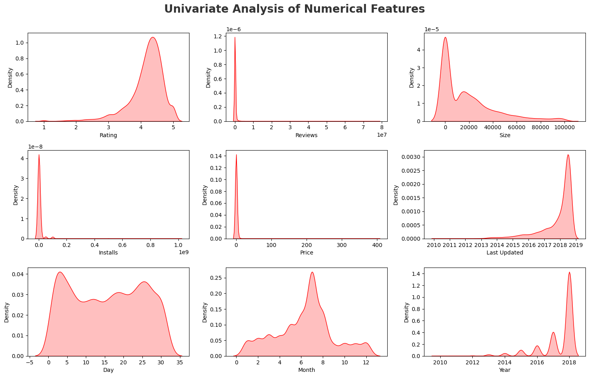
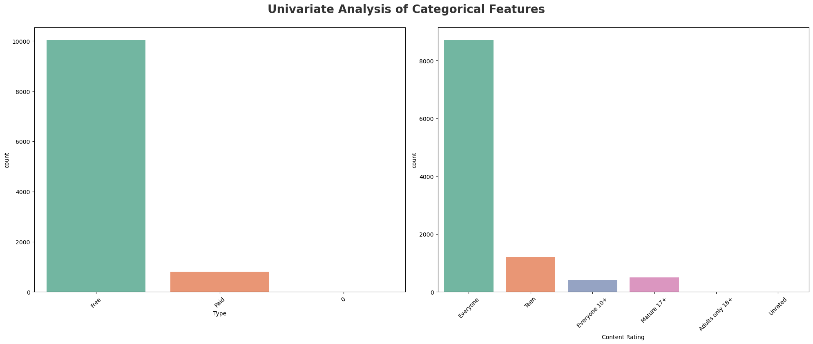
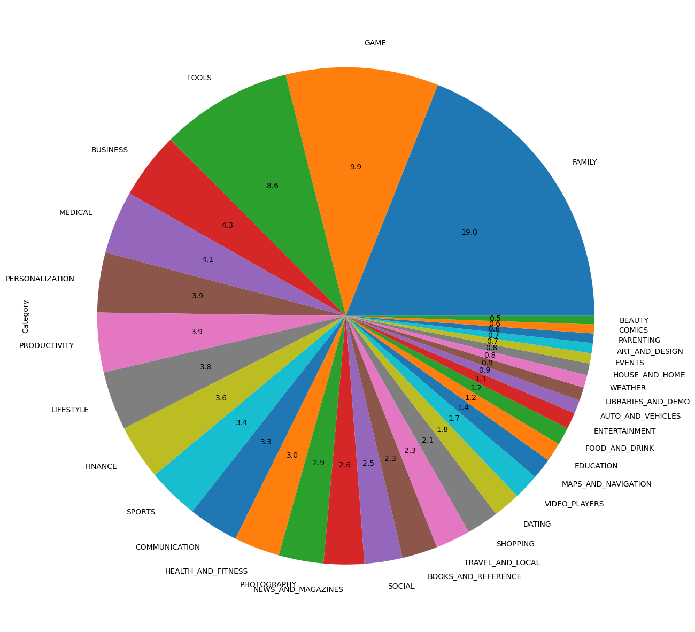
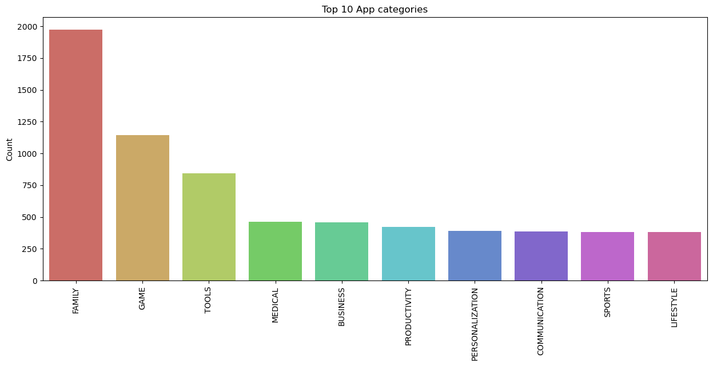

# Google Play Store Apps Data Analysis

This project focuses on cleaning and analyzing the **Google Play Store apps dataset** to understand patterns in app categories, installs, ratings, pricing, and user behavior.

All analysis and code are available in the notebook:  
**`GooglePlaystore.ipynb`**

---

# 1. Data Cleaning 

The raw dataset contained missing values, inconsistencies, special characters, and incorrect data types. Below is the exact cleaning process followed:

### Initial Inspection
- Reviewed dataset structure using `head()`, `info()` and missing value summary.
- Identified that many numeric features were incorrectly stored as **object/string types**.
### Handling Missing Values
- Missing values detected in: Rating, Type, Android Version, Current Version.
- These were documented and preserved or cleaned depending on analysis needs.
### Cleaning Individual Columns
####  **Reviews**
- Found non-numeric values (e.g., `"3.0M"`).
- Removed invalid row and converted Reviews to integer.
####   **Size**
- Values like `"8.0M"`, `"19k"`, and `"Varies with device"`.
- Replaced `"Varies with device"` with `NaN`.
- Standardized sizes to numeric MB/KB format.
####  **Installs**
- Contained symbols like `"+"` and commas (`"1,000+"`).
- Removed special characters and converted to integer.
####  **Price**
- Contained `$` symbol.
- Cleaned and converted to float.
####  **Last Updated**
- Converted to proper datetime.
- Extracted **Day**, **Month**, and **Year** from the date.
###  Removing Duplicates
- Found **1,181 duplicate app names**.
- Removed all duplicate entries, keeping only the first occurrence.
###  Final Feature Classification
- **Numerical Columns:** Rating, Reviews, Size, Installs, Price, Day, Month, Year  
- **Categorical Columns:** Category, Type, Content Rating, Genres  

---

#  2. Exploratory Data Analysis (EDA)

The goal of the EDA was to understand:
- App category distribution  
- How ratings are distributed  
- Whether higher installs relate to higher ratings  
- Free vs Paid app characteristics  
- Correlation between numeric features  

The visuals below summarize the EDA process.

---

 #  3. Visualizations & Insights

###  Univariate Analysis — Numerical Features

**Key Observations:**  
- **Rating** and **Last Updated Year** are **left-skewed**.  
- **Reviews, Size, Installs, and Price** are **right-skewed**, indicating outliers and high-value concentration.  
- Numerical features vary widely and require scaling/transformations for modeling.

---

###  Univariate Analysis — Categorical Features

**Key Observations:**  
- Majority of apps on the Play Store are **Free**.  
- **Everyone** is the most common content rating category.  
- Teen, Mature 17+, Adults Only 18+, and Unrated apps form very small percentages.

---

###  Category Distribution (Pie Chart)

**Insights:**  
- **Family (~19%)**, **Games (~10%)**, and **Tools (~9%)** dominate the store.  
- Categories like **Beauty**, **Comics**, **Art & Design**, and **Weather** have very few apps.  
- Indicates a high concentration of general-purpose consumer apps.

---

###  Top 10 App Categories (Bar Chart)

**Insights:**  
- **Family** category contains the highest number of apps.  
- **Games**, **Tools**, **Medical**, **Business**, and **Productivity** follow.  
- Niche categories represent a small share of total apps.

---

###  Categories with the Highest Number of Installations

**Insights:**  
- **GAME** category leads with nearly **35 billion installations**.  
- **Communication** apps are next due to widely used services (WhatsApp, Skype, Gmail).  
- Tools, Productivity, Social, and Photography categories also see high install volumes.

---

###  Top 5 Most Installed Apps in Popular Categories

**Category-wise Insights:**

- **GAME:** *Subway Surfers* is the most installed game.  
- **COMMUNICATION:** *Hangouts* leads, followed by *WhatsApp* and *Skype*.  
- **PRODUCTIVITY:** *Google Drive* dominates with 1B+ installs.  
- **SOCIAL:** *Instagram* leads, followed by *Facebook* and *Google+*.

---

###  Apps With Perfect 5-Star Rating

**Insights:**  
- There are **271 apps** with a perfect **5.0 rating**.  
- The top-rated app is **"CT Brain Interpretation"** from the **Family** category.  
- Perfect ratings are rare and usually appear in niche apps with highly satisfied users.

---

# 4. Key Insights (Summary)

- **Family is the largest category (~18%)**, followed by Games (~11%).  
- **Free apps dominate the store (>90%).**  
- **Apps with high installs generally have higher ratings.**  
- **Paid apps tend to have slightly higher median ratings than free apps.**  
- **Size does not strongly influence rating.**  
- **Reviews and Installs are strongly correlated.**

---

#  Dataset Source
Public dataset used for this project:  
https://raw.githubusercontent.com/krishnaik06/playstore-Dataset/main/googleplaystore.csv

---
